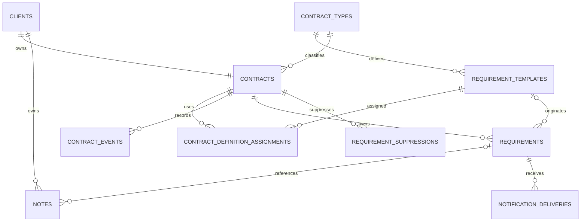

# V1 Entity-Relationship Diagram

## Integrity rules

| Relationship or key | Database behavior |
| --- | --- |
| Client to contract | `contracts.client_id` is unique; a client has at most one contract row |
| Client ownership | Deleting a client cascades through its contract graph and notes |
| Definitions | Referenced contract types and templates use restricted deletion |
| Definition version | `(lineage_id, version)` is unique for types and templates |
| Occurrences | `occurrence_key` is unique and nullable for ad hoc work |
| Suppressions | `occurrence_key` is unique so a deleted generated occurrence stays deleted |
| Notes | Deleting a linked requirement sets `notes.requirement_id` to null |
| Deliveries | `(requirement_id, delivery_kind, delivery_date)` is unique |
| Dashboard access | Active flags, statuses, due dates, pinned flags, and update moments are indexed |

Public UUID strings are unique and are the only identifiers exposed by business APIs. Numeric keys
remain inside Room-backed implementations.
